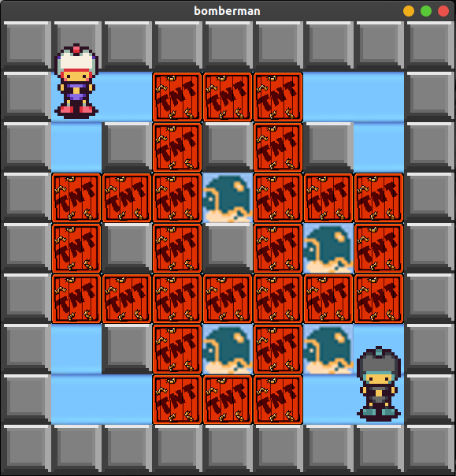

     
    
    </a>
     

# Ejecución
- Instale o [JDK](https://www.oracle.com/technetwork/java/javase/downloads) do Java na sua máquina, se ainda não tiver.
- Ejecute los comandos:
   - `cd src`
   - Compile: `javac *.java`
   - Inicie o servidor: `java Server`
   - Inicie o cliente: `java Client`

# Introducción

Lanzado por el desarrollador Hudson Soft en 1983, el clásico Bomberman fue uno de los juegos más conocidos de la historia. Es un juego de estrategia donde gana el que hace estallar al oponente, siempre y cuando no se haya suicidado antes. Esto requiere destruir paredes no fijas con bombas explosivas para abrir un camino y también confiar en la suerte para encontrar elementos al azar que mejoren al personaje, como una mejora en el alcance de la bomba o un aumento del número máximo de bombas simultáneas.

# Objetivo

Desarrolle programas Java para que al menos dos personas, posiblemente ubicadas de forma remota, puedan jugar interactuando a través del teclado en un mapa 2D que se muestra al usuario a través de una interfaz gráfica.

# Descripción
El juego presenta una arquitectura cliente-servidor donde dos o cuatro jugadores remotos, interactuando con programas cliente idénticos, compiten a través de un programa servidor que también es remoto. Estos programas se desarrollarán utilizando el lenguaje Java y Swing para el desarrollo de la interfaz.
A través de un mapa desplegado por una interfaz gráfica, el jugador realizará sus movimientos con las teclas W, A, S, D para mover su personaje hacia arriba, izquierda, abajo o derecha, y al presionar ESPACIO se colocará la bomba en la posición actual . El servidor, responsable de la intermediación de los programas cliente, está esperando los movimientos realizados por los clientes. Cuando se recibe un movimiento, el servidor hará la consistencia del movimiento, actualizará una representación interna del juego y devolverá a todos los clientes el estado actual del mapa. Si, por otro lado, se intenta con un movimiento no válido, el servidor ignorará el movimiento.

